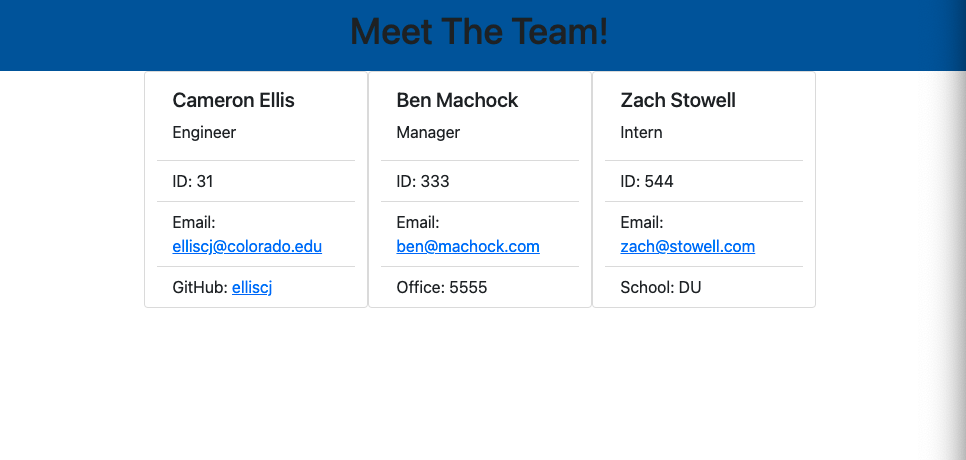

# Team Profile Generator

## Description

This project was created to be able to give companies a quick and effective way to create a simple profile page to show off their amazing staff. It also allows for quick and easy information retrieval of employee information.

## Table of Contents

- [Installation](#installation)
- [Usage](#usage)
- [Tests](#tests)
- [Contributing](#contributing)
- [License](#license)
- [Link](#link)
- [Screenshot](#screenshot)
- [Questions](#questions)

## Installation

    npm i

## Usage

Once the repository has been cloned to your local machine, you can simply run 'node index.js' to invoke the application from your terminal.

## Tests

    npm run test

## Contributing

Please follow the Contributor Covenant.

## License

This project is licensed under the MIT license. (c) 2021

## Link

https://drive.google.com/file/d/1mU_18QjSk8cC_4EdANQkLtnKze_AHbnZ/view?usp=sharing

## Screenshot

## Questions

#### If you have questions or would like to contact me for more information, you can find me on Git Hub or send me and email.

- https://github.com/elliscj
- elliscj@colorado.edu
